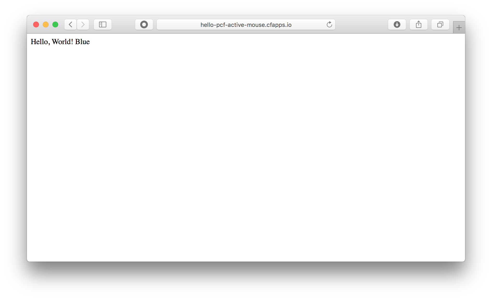

# Blue Green デプロイメント
Pivotal Cloud Foundry の機能を使用して、[Blue Green デプロイメント](https://martinfowler.com/bliki/BlueGreenDeployment.html)を行います。

## 概要 / 説明
Blue Green デプロイメントとは、Blue 環境と Green 環境の２つの環境を用意しておき、それらの環境へのルーティングを切り替える事でダウンタイムリスクを軽減するデプロイ方法です。

Pivotal Cloud Foundry では、`cf map-route` と `umnap-route` コマンドを使用してルーティング設定を行うことができます。
これらのコマンドによるルーティング設定により、Blue Green デプロイメントを実現します。


## 前提 / 環境
- [Java アプリケーションのデプロイ](https://github.com/shinyay/pcf-workshop-deploy-java/blob/master/README.md)
  - [事前作業](https://github.com/shinyay/pcf-workshop-prerequisite/blob/master/README.md)

## 手順 / 解説
### Blue 環境用のアプリケーション修正

- 出力メッセージに "Blue" を追加

<details><summary>編集済みソースコード</summary>

```
@GetMapping("/")
String hello() {
    return "Hello, World! Blue";
}
```
</details>

#### Blue 環境用のアプリケーションをデプロイ
以下のコマンドでビルド＆デプロイを行います。

```
$ ./gradlew clean build -x test
$ cf push
```

#### Blue 環境用のアプリケーションの動作確認
以下のコマンドで定期的にアプリケーションにアクセスし動作確認をします。

```
$ while true; do curl -s http://<アプリケーションURL>; echo; sleep 1;done
```

<details><summary>実行結果</summary>

```
Hello, World! Blue
Hello, World! Blue
Hello, World! Blue
Hello, World! Blue
Hello, World! Blue
Hello, World! Blue
```
</details>

### Green 環境用のアプリケーション修正

- 出力メッセージに "Green" を追加

<details><summary>編集済みソースコード</summary>

```
@GetMapping("/")
String hello() {
    return "Hello, World! Green";
}
```
</details>

#### Green 環境用のアプリケーションをデプロイ
以下のコマンドでビルド＆デプロイを行います。
Manifest.yml に定義しているアプリケーション名を上書きしてデプロイを行います。

```
$ ./gradlew clean build -x test
$ cf push hello-pcf-green
```

#### アプリケーションの確認
デプロイ済みのアプリケーションを `cf apps` コマンドで確認します。

```
$ cf apps

syanagihara@pivotal.io として組織 syanagihara-org / スペース development 内のアプリを取得しています...
OK

名前              要求された状態   インスタンス   メモリー   ディスク   URL
hello-pcf         started          1/1            1G         1G         hello-pcf-active-mouse.cfapps.io
hello-pcf-green   started          1/1            1G         1G         hello-pcf-green-daring-mandrill.cfapps.io
```

Blue アプリケーションへのアクセス



Green アプリケーションへのアクセス


### Blue 環境へのリクエストを Green 環境へルーティング
以下のコマンドで、Blue 環境へのリクエストが Green 環境へルーティングするように設定します。

```
$ cf map-route < Green 環境のアプリケーション名> <ドメイン名(ここでは cfapps.io)> --hostname <ホスト名>
```

<details><summary>実行結果</summary>

```
$ cf map-route hello-pcf-green cfapps.io --hostname hello-pcf-active-mouse

syanagihara@pivotal.io として組織 syanagihara-org / スペース development の経路 hello-pcf-active-mouse.cfapps.io を作成しています...
OK
経路 hello-pcf-active-mouse.cfapps.io は既に存在しています
syanagihara@pivotal.io として経路 hello-pcf-active-mouse.cfapps.io を組織 syanagihara-org / スペース development 内のアプリ hello-pcf-green に追加しています...
OK
```
</details>

Blue と Green の2つのアプリケーションに同じURLでアクセス出来る状態になりました。
cURL でのアクセス確認は以下のように Blue と Green 両方のメッセージが表示されます。

```
Hello, World! Green
Hello, World! Blue
Hello, World! Blue
Hello, World! Green
Hello, World! Green
Hello, World! Blue
```

### Blue アプリケーションへのルーティングの除外
以下のコマンドで、Blue 環境にデプロイしていたアプリケーションへのルーティングを外します。

```
$ cf unmap-route < Blue 環境のアプリケーション名> <ドメイン名(ここでは cfapps.io)> --hostname <ホスト名>
```

<details><summary>実行結果</summary>

```
$ cf unmap-route hello-pcf cfapps.io --hostname hello-pcf-active-mouse

syanagihara@pivotal.io として組織 syanagihara-org / スペース development 内のアプリ hello-pcf から経路 hello-pcf-active-mouse.cfapps.io を削除しています...
OK
```
</details>

Blue にルーティングされず、Green のみへのルーティングとなりました。
cURL でのアクセス確認は以下のように Green のみのメッセージが表示されます。

```
Hello, World! Green
Hello, World! Green
Hello, World! Green
Hello, World! Green
Hello, World! Green
Hello, World! Green
```

### Blue 環境用 アプリケーションと Green 環境アクセスルートの削除
今の状態は、Green 環境用のアプリケーションに Blue 環境用のルーティングと Green 環境用のルーティングでアクセス出来る状態です。
また、アクセスする事ができなくなった Blue 環境用のアプリケーションが残っている状態です。

```
$ cf apps

syanagihara@pivotal.io として組織 syanagihara-org / スペース development 内のアプリを取得しています...
OK

名前              要求された状態   インスタンス   メモリー   ディスク   URL
hello-pcf         started          1/1            1G         1G
hello-pcf-green   started          1/1            1G         1G         hello-pcf-active-mouse.cfapps.io, hello-pcf-green-daring-mandrill.cfapps.io
```

Green 環境用のアプリケーション (`hello-pcf-green`) に問題がなければ、
Blue 環境用 アプリケーションと Green 環境へのルーティングを削除します。

#### Blue 環境用 アプリケーションの削除
```
$ cf delete hello-pcf

アプリ hello-pcf を削除しますか?> y
syanagihara@pivotal.io として組織 syanagihara-org / スペース development 内のアプリ hello-pcf を削除しています...
OK
```

#### Green 環境へのルーティングの削除
```
$ cf unmap-route hello-pcf-green cfapps.io --hostname hello-pcf-green-daring-mandrill

syanagihara@pivotal.io として組織 syanagihara-org / スペース development 内のアプリ hello-pcf-green から経路 hello-pcf-green-daring-mandrill.cfapps.io を削除しています...
OK
```

#### アプリケーションの確認
`cf apps` で確認すると、不要となったアプリケーションとルーティングが削除されている事が確認できます。

<details><summary>実行結果</summary>

```
$ cf apps

syanagihara@pivotal.io として組織 syanagihara-org / スペース development 内のアプリを取得しています...
OK

名前              要求された状態   インスタンス   メモリー   ディスク   URL
hello-pcf-green   started          1/1            1G         1G         hello-pcf-active-mouse.cfapps.io
```
</details>

### アプリケーション名の修正
アプリケーション名が Green 環境用に作成した名前なので、元の Blue 環境用の名前に修正します。
名前を変更するには、以下のコマンドを使用します。

```
$ cf rename <現在のアプリケーション名> <新しいアプリケーション名>
```

<details><summary>実行結果</summary>

```
$ cf rename hello-pcf-green hello-pcf

syanagihara@pivotal.io として組織 syanagihara-org / スペース development 内のアプリ hello-pcf-green を hello-pcf に名前変更しています...
OK
```
</details>


#### アプリケーションの確認
`cf apps` で確認すると、アプリケーション名が Blue 環境にデプロイしていた名前に修正され、
アプリケーション名とルーティングが共に最初の状態になっている事が確認できます。

<details><summary>実行結果</summary>

```
$ cf apps

syanagihara@pivotal.io として組織 syanagihara-org / スペース development 内のアプリを取得しています...
OK

名前        要求された状態   インスタンス   メモリー   ディスク   URL
hello-pcf   started          1/1            1G         1G         hello-pcf-active-mouse.cfapps.io
```
</details>

### Blue Green デプロイメントの切り戻し
Blue 環境のアプリケーションを削除する前であれば、新しいアプリケーション(Green 環境)に問題が確認された場合に切り戻しができます。
手順は、以下のように Blue Green デプロイメントの手順を逆に実施します。

```
$ cf map-route < Blue 環境のアプリケーション名> <ドメイン名(ここでは cfapps.io)> --hostname <ホスト名>
$ cf unmap-route < Green 環境のアプリケーション名> <ドメイン名(ここでは cfapps.io)> --hostname <ホスト名>
```

## まとめ / 振り返り
